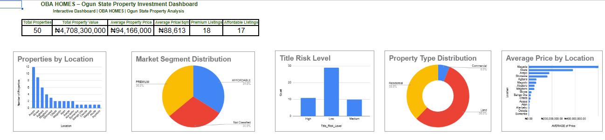

# Ogun State Property Investment Dashboard

## Project Overview

This project analyzes 50 real estate properties across key locations in Ogun State, Nigeria.

## Business Problem

Real estate investors often struggle to identify:
- High-value investment locations
- Property distribution
- Title risk exposure

## Tools Used

- Google Sheets
- Pivot Tables
- Pivot Charts
- Data Cleaning
- Dashboard Design

## Key Performance Indicators (KPIs)

- Total Properties
- Total Property Value
- Average Property Price
- Average Price per Sqm
- Premium Listings
- Affordable Listings

## Dashboard Features

- Properties by Location
- Market Segment Distribution
- Title Risk Level Analysis
- Property Type Distribution
- Average Price by Location

## Data Cleaning

- Removed leading and trailing spaces in location names.
- Standardized property categories.
- Handled missing Price per Sqm values without making unsupported assumptions.

## Key Insights

- The dataset contains 50 properties across Ogun State.
- Land is the largest property category.
- Property prices vary significantly by location.
- Most properties have Low Risk title documentation.

## Skills Demonstrated

- Data Cleaning
- Data Analysis
- Dashboard Development
- KPI Design
- Data Visualization
- Business Reporting

## Dashboard Preview

## Microsoft Excel Version

This project was enhanced in Microsoft Excel with:

- Interactive slicers
- Improved KPI card design
- Enhanced dashboard layout
- Property Title Risk Distribution by Location
- Interactive filtering for business analysis
  
## Files Included

- Cleaned dataset (CSV)
- Google Sheets Dashboard
- Microsoft Excel Dashboard (Interactive)
  
## Author

**Adesanya Oluwadaramola**

Junior Data Analyst | SQL | Excel | Google Sheets | Real Estate Analytics
